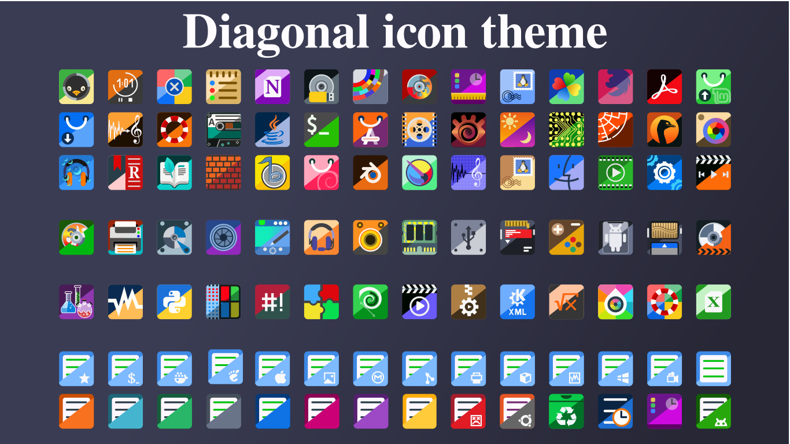

# Diagonal Icon Theme

Colorful icon theme inspired by popular icon sets such as Yaru, Evolvere, and WhiteSur.

---

## Features

* Interactive installer (no command-line arguments required)
* POSIX-compliant shell script
* Compatible with Linux and *BSD systems
* Supports multiple distributions and desktop environments
* Customizable folder colors
* Portable installation (create installable archive without installing)
* Automatic detection of system (distribution and window manager)
* Includes uninstall script
* Includes cursor themes (light/dark + color variants)
* Prebuilt default icon packages included for each supported desktop environment

---

## Compatibility

* POSIX shell ✔
* Linux ✔
* *BSD ✔ (FreeBSD, OpenBSD tested)
* Bash-specific features ❌

### Tested shells

* dash
* ash
* sh (POSIX)

---

## Supported Desktop Environments

* Budgie
* Cinnamon
* GNOME
* KDE
* MATE
* Xfce
* Cosmic

---

## Preview

Images and screenshots of the icons can be found in the "screenshots" folder of the git repository.

---

## Download Options

You can use the theme in two ways:

### 1. Full installer (recommended)

In this case, you can configure the distribution type, folder colors, and desktop edition type.

`git clone https://github.com/tamascsabi/Diagonal-icon-theme.git`

### 2. Prebuilt icon themes

This will give you a ready-made package that contains the default settings.

The packages can be found in the packages folder of the git repository.

The repository also includes prebuilt default icon packages for each supported desktop environment:

* GNOME
* KDE
* Xfce
* Cinnamon
* MATE
* Budgie
* Cosmic

These packages are ready to use and can be extracted directly into:

`tar -xvf Diagonal-3.3.tar.xz -C ~/.icons/`

or

`sudo tar -xvf Diagonal-3.3.tar.xz -C /usr/share/icons/`

No installation script is required.

---

## Supported Distributions

|              |              |              |               |
| :----------- | :----------- | :----------- | :-----------  |
| Arch         | CachyOS      | Debian       | Devuan        |
| EndeavourOS  | Fedora       | FreeBSD      | Garuda        |
| Gentoo       | Kali         | KDE neon     | Kubuntu       |
| Mageia       | Manjaro      | Mint         | Nixos         |
| OpenBSD      | OpenMandriva | OpenSUSE     | Parrot        | 
| PcLinuxOS    | Pop!_OS      | Slackware    | Solus         | 
| Ubuntu       | Zorin OS     |

---

## Folder Colors

|              |              |              |
| :----------- | :----------- | :----------- |
| Black        | Blue         | Cyan         |
| Green        | Grey         | Magenta      |
| Orange       | Red          | Ubuntu       |
| Violet       | White        | Yellow       |

---

## Cursor Themes

Each icon theme includes: 

* Light and Dark variants.

* Distribution-specific color cursor theme.

---

## Installation

Run the installer script from the main directory:

`./install.sh`

The installer is interactive and will guide you through:

* Distribution selection
* Desktop environment selection
* Folder color selection

If your system is not recognized, default settings will be used.

---

## Distribution specific settings and non-standard installation methods
The installer also supports non-standard installation methods.

* FreeBSD and OpenBSD: icons are installed in the `/usr/local/share/icons` directory if installed systemwide.
* NixOS: icons are installed to `/var/opt/icons.`

  When installing a NixOS version, the user must still configure the system to include the installed icon library in the icon search path.
  
  A sample configuration file is provided in the installer's `/config` directory.
  
---

## Configuration assistance programs

The `/apps` directory contains programs that help with post-installation configuration.

With these, we can easily change the settings of our installed Diagonal icon theme.

* `snap_import.sh`
 
   Since programs installed by snap use their own icons, this small program helps you configure how these programs use the system icon.

* `folder_setup.sh`

   We can change the folder colors used by the system to the color of our choice.
   
   We can use folder colors from other distributions, as well as the basic colors.
   
* `cursors_delete.sh`

   It helps to remove cursor themes that are no longer used.
   
* `app_import.sh`

   Some applications use their own icons.
   
   This program helps you replace your own program icons with the icons used by the system.

---

## Portable Mode

You can create a compressed icon package without installing it.

* Useful for transferring to another system
* The installer also creates a backup archive during installation

---

## Uninstallation

Run the uninstall script:

`./uninstall.sh`

---

## Available on

- KDE Store: https://store.kde.org/p/2361111
- GitHub Releases: https://github.com/tamascsabi/Diagonal-icon-theme

## License

This project is dual-licensed:

* Icons are licensed under the Creative Commons Attribution 4.0 International License (CC BY 4.0)
* Scripts are licensed under the GNU General Public License v3.0 (GPLv3)

See the LICENSE file for details.

---

## Notes

* The installer attempts to detect your system automatically
* Manual override is always possible during installation
* Designed with portability and minimal dependencies in mind
